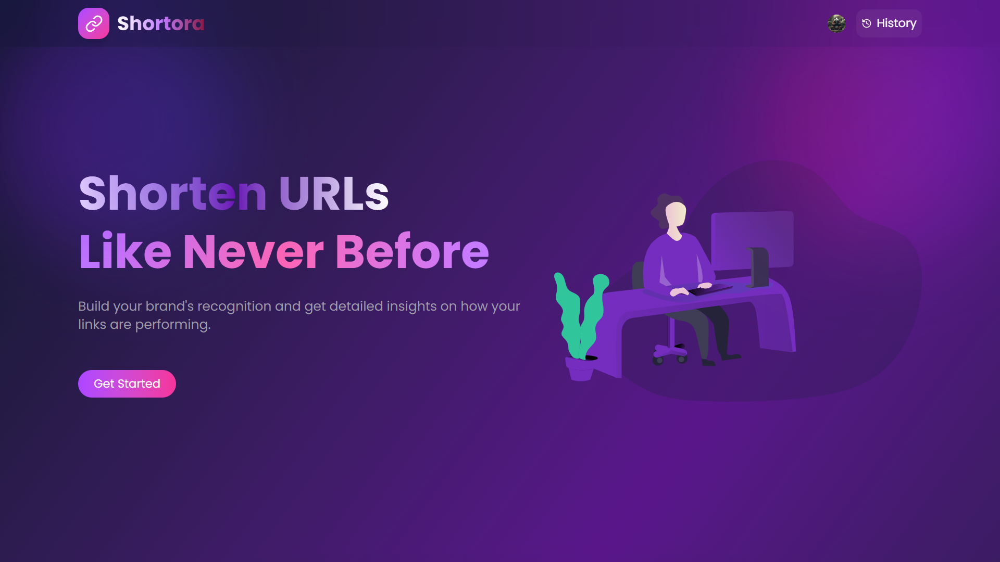
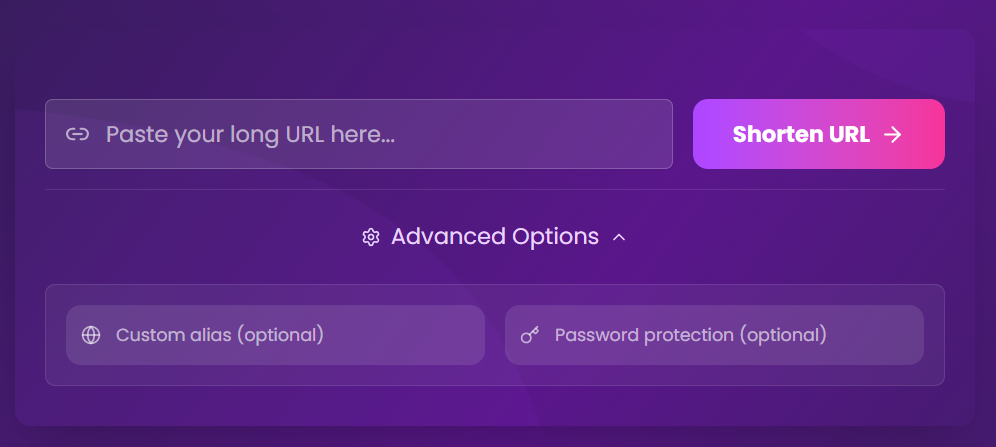

# Shortora - URL Shortener

A modern, full-stack URL shortening service built with React and Node.js. Create custom short links, and manage your URLs with ease.

## 🌟 Features

- **Custom Short URLs**: Create personalized aliases for your links
- **Password Protection**: Secure your links with optional password protection
- **User Authentication**: Sign up and manage your links with Clerk authentication
- **Link History**: Track and manage all your shortened URLs
- **Analytics**: Monitor link performance and click statistics
- **Responsive Design**: Beautiful, mobile-first UI built with Tailwind CSS
- **Real-time Updates**: Instant link creation and management

## 🚀 Live Demo

- **Frontend**: [https://shortora.vercel.app](https://shortora.vercel.app)
- **API**: Deployed on Vercel

## � Screenshots

### Home Page

*Clean and intuitive interface for creating short links*

### Link Creation

*Simple form to create custom short links with optional password protection*

## �🛠️ Tech Stack

### Frontend
- **React 19** - Modern React with latest features
- **Vite** - Fast build tool and development server
- **Tailwind CSS 4** - Utility-first CSS framework
- **React Router 7** - Client-side routing
- **Clerk** - Authentication and user management
- **Axios** - HTTP client for API requests
- **Lucide React** - Beautiful icon library

### Backend
- **Node.js** - JavaScript runtime
- **Express.js 5** - Web application framework
- **MongoDB** - NoSQL database with Mongoose ODM
- **Clerk** - Authentication middleware
- **CORS** - Cross-origin resource sharing
- **dotenv** - Environment variable management

## 📁 Project Structure

```
URL Shortener/
├── client/                 # React frontend application
│   ├── src/
│   │   ├── components/     # React components
│   │   ├── assets/         # Static assets
│   │   └── main.jsx        # Application entry point
│   ├── package.json
│   └── vite.config.js
├── server/                 # Node.js backend API
│   ├── config/             # Database configuration
│   ├── controllers/        # Route controllers
│   ├── middleware/         # Custom middleware
│   ├── model/              # MongoDB models
│   ├── routes/             # API routes
│   ├── lib/                # Utility functions
│   ├── package.json
│   └── index.js            # Server entry point
└── README.md
```

## 🚀 Getting Started

### Prerequisites

- Node.js (v18 or higher)
- MongoDB database
- Clerk account for authentication

### Installation

1. **Clone the repository**
   ```bash
   git clone <repository-url>
   cd "URL Shortener"
   ```

2. **Install server dependencies**
   ```bash
   cd server
   npm install
   ```

3. **Install client dependencies**
   ```bash
   cd ../client
   npm install
   ```

### Environment Setup

1. **Server Environment Variables**
   
   Create a `.env` file in the `server` directory:
   ```env
   MONGODB_URI=your_mongodb_connection_string
   CLERK_PUBLISHABLE_KEY=your_clerk_publishable_key
   CLERK_SECRET_KEY=your_clerk_secret_key
   CLIENT_URL=http://localhost:5173
   PORT=3000
   ```

2. **Client Environment Variables**
   
   Create a `.env` file in the `client` directory:
   ```env
   VITE_CLERK_PUBLISHABLE_KEY=your_clerk_publishable_key
   VITE_API_URL=http://localhost:3000
   ```

### Running the Application

1. **Start the backend server**
   ```bash
   cd server
   npm start
   ```

2. **Start the frontend development server**
   ```bash
   cd client
   npm run dev
   ```

3. **Access the application**
   - Frontend: http://localhost:5173
   - Backend API: http://localhost:3000

## 📚 API Documentation

### Base URL
```
http://localhost:3000
```

### Endpoints

#### Health Check
- **GET** `/check` - Server health status

#### Authentication
- **POST** `/auth/*` - User authentication routes

#### Link Management
- **POST** `/link` - Create a new short link
- **GET** `/getLink/:alias` - Retrieve original URL by alias
- **GET** `/history` - Get user's link history

## 🔧 Development

### Available Scripts

#### Client
- `npm run dev` - Start development server
- `npm run build` - Build for production
- `npm run preview` - Preview production build
- `npm run lint` - Run ESLint

#### Server
- `npm start` - Start the server
- `npm test` - Run tests (not implemented)

### Code Style

- ESLint configuration for consistent code style
- Prettier integration recommended
- Follow React and Node.js best practices

## 🚀 Deployment

The application is configured for deployment on Vercel:

1. **Frontend Deployment**
   - Automatic deployment from main branch
   - Environment variables configured in Vercel dashboard

2. **Backend Deployment**
   - Serverless functions on Vercel
   - MongoDB Atlas for production database

## 🤝 Contributing

1. Fork the repository
2. Create a feature branch (`git checkout -b feature/amazing-feature`)
3. Commit your changes (`git commit -m 'Add some amazing feature'`)
4. Push to the branch (`git push origin feature/amazing-feature`)
5. Open a Pull Request

## 📝 License

This project is licensed under the ISC License.

## 🙏 Acknowledgments

- [Clerk](https://clerk.dev/) for authentication services
- [Vercel](https://vercel.com/) for hosting and deployment
- [MongoDB](https://mongodb.com/) for database services
- [Tailwind CSS](https://tailwindcss.com/) for styling

## 📞 Support

For support, email [kaushikverma321@gmail.com] or create an issue in this repository.

---

Made with ❤️ by [Kaushik Verma]
